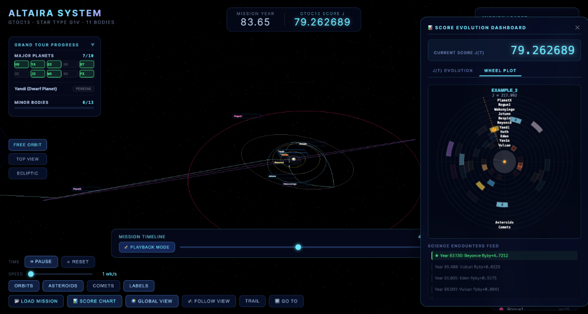

# Altaira System — GTOC13 Trajectory Visualizer

An interactive 3D web-based visualization tool for the Altaira exoplanetary system from the [13th Global Trajectory Optimisation Competition (GTOC13)](https://gtoc.jpl.net/gtoc13/). It allows users to visualize trajectories, analyze flight constraints, and view score evolution (including a linear $J(t)$ chart and a circular Wheel Plot matching the JPL organizers' design).

A sample mission file is included under `examples/complete_mission.txt` for testing.



---

## Deployment Methods

You can deploy and run this application on any machine using either **Docker** (recommended for zero-dependency runs) or **Node.js/NPM**.

---

### Option 1: Docker Deployment (Recommended)

This method packages the application and runs it inside a container using an Nginx server. You only need Docker installed on the host machine.

#### 1. Start the container
Run the following command in the project root:
```bash
docker compose up --build -d
```

#### 2. Access the application
Once the build is complete, open your web browser and navigate to:
* **URL:** [http://localhost:8080](http://localhost:8080)

#### 3. Stop the container
To stop the application, run:
```bash
docker compose down
```

---

### Option 2: Local Deployment (Node.js & NPM)

Use this method if you want to run the dev server or build the project from scratch on your host machine.

#### Pre-requisites
* **Node.js:** v18.0.0 or higher
* **NPM:** v9.0.0 or higher

#### 1. Install dependencies
Install all required Node.js modules (Vite, Three.js, etc.):
```bash
npm install
```

#### 2. Run the development server
Start Vite's fast HMR dev server:
```bash
npm run dev
```
Open the local URL displayed in the terminal (typically `http://localhost:5173`).

#### 3. Build for production
To compile and minify the assets into static HTML/JS files:
```bash
npm run build
```
The compiled files will be located in the `dist/` directory, ready to be served by any static file hosting service.

#### 4. Preview the production build
To test the built production files locally:
```bash
npm run preview
```

---

## Features included
* **3D Trajectory Visualizer**: Orbit paths, spacecraft models, solar sail normal indicators, and trails.
* **Score Evolution Dashboard**:
  * **J(t) Evolution**: Real-time linear chart showing score progression.
  * **Wheel Plot**: A dynamic replication of the GTOC13 organizers' circular timeline plot, complete with planet rings, science/assist wedges, a radial playhead, spacecraft position mapping, and solar sail thrust profile (green for acceleration, red for braking, white for coasting) in the central star circle.
